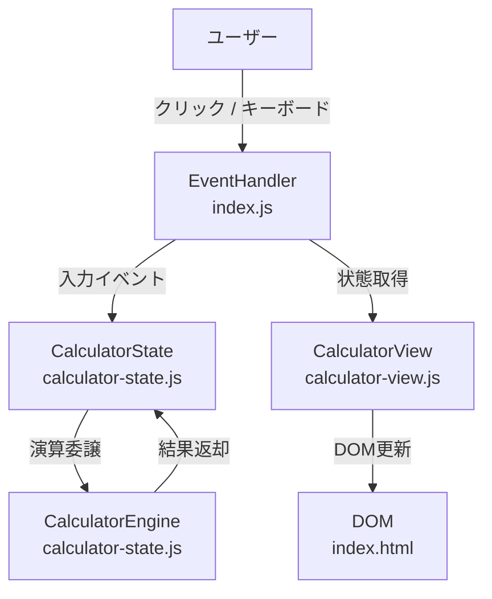
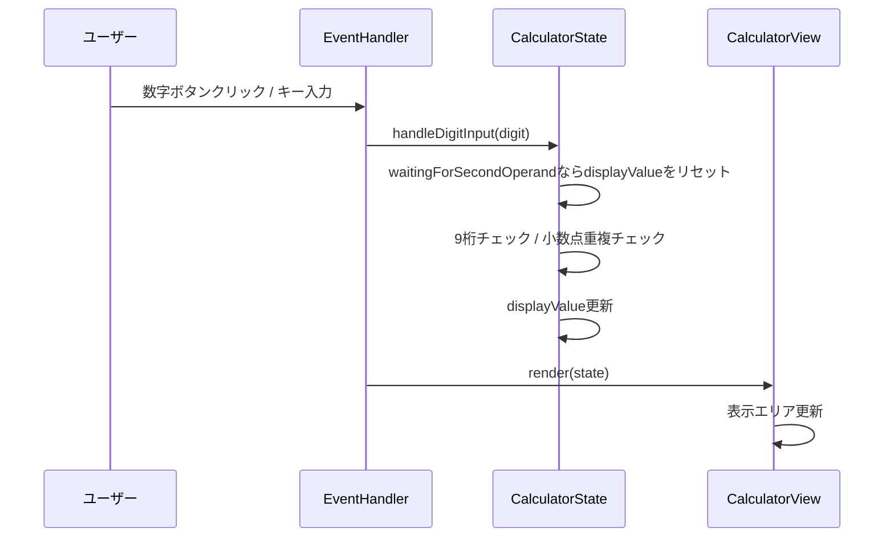
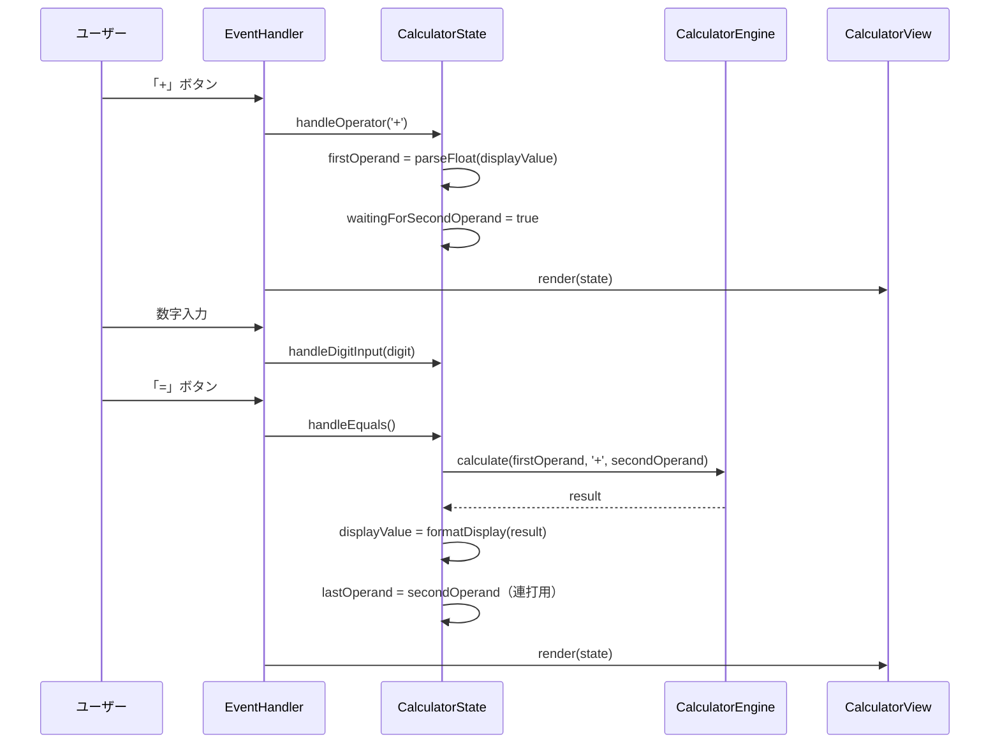

# 技術設計書: iphone-calculator

## Overview

本フィーチャーは、iOSの標準電卓アプリのUIデザインを再現したWebベースの電卓アプリケーションを提供する。演算機能は**足し算のみ**に限定し、ダークテーマ・円形ボタン・オレンジアクセントによる視覚的忠実度と、キーボード入力・アクセシビリティ対応を実現する。

**Purpose**: ユーザーにiPhoneと同等の操作感で足し算を実行できる軽量Webアプリを提供する。
**Users**: 一般ユーザー（スマートフォン・タブレット・デスクトップ問わず）。
**Impact**: 新規単独アプリとして実装する（既存システムへの影響なし）。

### Goals
- iOSカラースキームと円形ボタンで視覚的忠実度を実現
- 足し算の連続計算・繰り返しを正確に処理
- Tailwind CSS CDNで軽量なスタイリングを実現
- GitHub Pagesで静的ファイルとして公開可能にする

### Non-Goals
- 減算・乗算・除算の実装
- 計算履歴の永続化（ローカルストレージ等）
- バックエンドAPI・サーバーサイド処理
- Tailwind CSSのビルドステップ（CDN利用でビルド不要）

---

## Requirements Traceability

| 要件ID | 概要 | コンポーネント | インターフェース | フロー |
|--------|------|--------------|----------------|--------|
| 1.1–1.6 | UI外観・レイアウト | CalculatorView | renderDisplay, renderButtons | — |
| 2.1–2.5 | 数字・小数点入力 | CalculatorState, CalculatorView | handleDigitInput | 入力フロー |
| 3.1–3.4 | 足し算演算 | CalculatorEngine, CalculatorState | handleOperator, handleEquals | 演算フロー |
| 4.1–4.3 | AC/Cリセット | CalculatorState, CalculatorView | handleClear | — |
| 5.1–5.5 | 表示フォーマット | CalculatorView | formatDisplay | — |
| 6.1–6.5 | レスポンシブ・アクセシビリティ | CalculatorView, EventHandler | keydownListener | — |

---

## Architecture

### Architecture Pattern & Boundary Map

本アプリはMVCパターン（バニラJS）を採用する。外部依存・ビルドツールは不要で、3ファイル構成で責任を分離する。詳細な選定根拠は `research.md` の「Architecture Pattern Evaluation」を参照。



**Architecture Integration**:
- **選択パターン**: MVC（Vanilla JS）— ビルドツール不要・単機能に適切
- **ドメイン境界**: 状態・演算ロジック（CalculatorState/Engine）とUI描画（CalculatorView）を明確に分離
- **新規コンポーネント**: すべて新規（グリーンフィールド）
- ステアリング不在のため、汎用的なWeb標準に従う

### Technology Stack

| レイヤー | 選択 / バージョン | 役割 | 備考 |
|---------|-----------------|------|------|
| フロントエンド | HTML5 | UIマークアップ | セマンティックHTML・aria-label付与 |
| スタイリング | Tailwind CSS v3（CDN Play） | UIスタイリング | ビルド不要・CDNタグ1行で導入 |
| スクリプト | Vanilla JavaScript ES2020 | 状態管理・演算・DOM操作 | ビルド不要 |
| ホスティング | GitHub Pages | 静的ファイル公開 | `gh-pages`ブランチまたは`docs/`フォルダ方式 |
| ランタイム | ブラウザ直接 | Node.js不要 | 静的ファイルのみ |

---

## System Flows

### 入力フロー（数字・小数点）



### 演算フロー（足し算・イコール）



---

## Components and Interfaces

### コンポーネント概要

| コンポーネント | レイヤー | Intent | 要件カバレッジ | 主要依存 | コントラクト |
|--------------|---------|--------|--------------|---------|------------|
| CalculatorState | Model | 全状態の保持・遷移管理 | 2, 3, 4 | CalculatorEngine (P0) | State |
| CalculatorEngine | Model | 加算演算・表示フォーマット | 3, 5 | — | Service |
| CalculatorView | View | DOM更新・ボタン描画 | 1, 5, 6 | CalculatorState (P0) | State |
| EventHandler | Controller | ユーザー入力の受付と委譲 | 2, 3, 4, 6 | CalculatorState (P0), CalculatorView (P0) | Service |

---

### Model層

#### CalculatorState

| フィールド | 詳細 |
|----------|------|
| Intent | 電卓の全ステートを保持し、入力・演算・クリア操作の状態遷移を管理する |
| Requirements | 2.1, 2.2, 2.3, 2.4, 2.5, 3.1, 3.2, 3.3, 3.4, 4.1, 4.2, 4.3 |

**Responsibilities & Constraints**
- `displayValue`（文字列）の更新責任を単独で持つ
- 最大9桁制限・小数点重複防止のバリデーションを内部で行う
- `waitingForSecondOperand` フラグにより「結果表示後の新規入力開始」（要件2.4）を制御

**Dependencies**
- Outbound: CalculatorEngine — 加算演算実行 (P0)

**Contracts**: State [x]

##### State Management

**状態モデル:**

```typescript
interface CalculatorState {
  displayValue: string;               // 表示中の数値文字列（例: "123", "3.14"）
  firstOperand: number | null;        // 第1オペランド（+ 押下後に記憶）
  operator: '+' | null;               // 選択中の演算子
  waitingForSecondOperand: boolean;   // 第2オペランド入力待ちフラグ
  lastOperand: number | null;         // = 連打用に保持する直前の第2オペランド
  isResult: boolean;                  // 現在表示が計算結果かどうか
}
```

**状態遷移規則:**
- 初期状態: `{ displayValue: '0', firstOperand: null, operator: null, waitingForSecondOperand: false, lastOperand: null, isResult: false }`
- 数字入力時: `waitingForSecondOperand === true` なら `displayValue` をリセットして新規入力開始
- AC: 全フィールドを初期状態に戻す
- C: `displayValue` を `'0'` にリセット、他フィールドは保持

**Persistence & Consistency**: ブラウザメモリ内のみ。永続化なし。
**Concurrency**: 単一スレッド（ブラウザJS）のため競合なし。

**Implementation Notes**
- 浮動小数点誤差対策: `result.toPrecision(12)` → `parseFloat()` で表示前に丸める（詳細は `research.md` 参照）
- `displayValue` は常に文字列で保持し、演算時のみ `parseFloat()` で数値変換する

---

#### CalculatorEngine

| フィールド | 詳細 |
|----------|------|
| Intent | 加算演算の実行と表示フォーマット変換を担う純粋関数モジュール |
| Requirements | 3.1, 3.2, 5.1, 5.2, 5.3, 5.4 |

**Responsibilities & Constraints**
- 副作用なし（純粋関数のみ）
- `calculate` は加算のみをサポートする（拡張予定なし）
- `formatDisplay` は表示文字列の整形責任を単独で持つ

**Dependencies**
- 外部依存なし

**Contracts**: Service [x]

##### Service Interface

```typescript
interface CalculatorEngineService {
  /**
   * 2つの数値を加算して返す
   * @precondition a, b は有限数（NaN・Infinity不可）
   * @postcondition 浮動小数点誤差をtoPrecision(12)で丸めた結果を返す
   */
  calculate(a: number, operator: '+', b: number): number;

  /**
   * 数値を表示用文字列に変換する
   * @postcondition 整数なら小数点なし、小数なら末尾ゼロ省略、9桁超なら指数表記
   */
  formatDisplay(value: number): string;
}
```

- Preconditions: `calculate` は `operator === '+'` のみ受け付ける
- Postconditions: `formatDisplay` は9桁以内なら通常表記、超過時は指数表記（例: `1.23e+10`）
- Invariants: 入力が有限数でない場合は `'エラー'` を返す

---

### View層

#### CalculatorView

| フィールド | 詳細 |
|----------|------|
| Intent | CalculatorStateを受け取り、DOM全体を同期的に更新する |
| Requirements | 1.1, 1.2, 1.3, 1.4, 1.5, 1.6, 5.4, 5.5, 6.3, 6.4, 6.5 |

**Responsibilities & Constraints**
- 状態を受け取ってDOM更新するのみ（状態変更なし）
- ボタン定義（ラベル・色・aria-label）の静的マッピングを保持する
- フォントサイズ自動縮小（要件5.4）はdisplayValueの桁数をもとにCSSクラス切替で実現

**Dependencies**
- Inbound: EventHandler — render(state) 呼び出し (P0)
- Inbound: CalculatorState — 状態オブジェクト参照 (P0)

**Contracts**: State [x]

##### State Management

**ボタン定義マップ:**

```typescript
type ButtonType = 'digit' | 'operator' | 'function' | 'equals';

interface ButtonConfig {
  label: string;        // 表示ラベル（例: "7", "+", "AC"）
  ariaLabel: string;    // スクリーンリーダー用（例: "7", "足す", "全消去"）
  type: ButtonType;
  wide?: boolean;       // 「0」ボタンのpill形状フラグ
}
```

**DOM更新契約:**
- `render(state: CalculatorState): void` — 呼ばれるたびに表示エリアとボタン状態を同期
- `operator === '+'` かつ `waitingForSecondOperand === true` のとき、「+」ボタンにハイライトCSSクラス付与（要件5.5）
- `displayValue !== '0'` かつ `!isResult` のとき、AC/CボタンのラベルをCに変更（要件4.3）

**Implementation Notes**
- Tailwindクラスでスタイリング: 背景色 `bg-black`、ボタン円形 `rounded-full`、オレンジ `bg-[#FF9500]`、ダークグレー `bg-[#333333]`、ライトグレー `bg-[#a5a5a5]`
- フォントサイズ縮小: JS側で `displayValue` の桁数に応じてTailwindクラスを切り替え（`text-7xl` → `text-5xl` → `text-3xl`）
- タップ領域: `w-20 h-20`（80px）がデフォルト。`min-w-[44px] min-h-[44px]` を保証（要件6.4）
- 「0」ボタンのpill形状: `rounded-full col-span-2 pl-8 justify-start`
- ハイライト: `+` 選択中は `bg-white text-[#FF9500]` クラスを動的付与（要件5.5）

---

### Controller層

#### EventHandler

| フィールド | 詳細 |
|----------|------|
| Intent | ボタンクリックとキーボード入力を受け取り、CalculatorStateのメソッドに委譲する |
| Requirements | 2.1, 2.2, 3.1, 3.2, 4.1, 4.2, 6.2 |

**Responsibilities & Constraints**
- DOMイベントリスナーの登録・解除管理
- キーボードマッピング（数字キー・Enter・Escape・Backspace）の変換

**Dependencies**
- Outbound: CalculatorState — 状態変更メソッド呼び出し (P0)
- Outbound: CalculatorView — render() 呼び出し (P0)

**Contracts**: Service [x]

##### Service Interface

```typescript
interface EventHandlerService {
  /** DOMイベントリスナーを登録して電卓を起動する */
  init(state: CalculatorState, view: CalculatorView): void;
}
```

**キーボードマッピング:**

| キー | アクション |
|------|----------|
| `0`–`9` | handleDigitInput(key) |
| `.` | handleDigitInput('.') |
| `+` | handleOperator('+') |
| `Enter` / `=` | handleEquals() |
| `Escape` | handleClear(true) — AC相当 |
| `Backspace` | handleClear(false) — C相当 |

---

## Data Models

### Domain Model

本アプリに永続データなし。ドメインオブジェクトはCalculatorStateのみ（前掲のインターフェース定義参照）。

**ビジネスルール・不変条件:**
- `displayValue` の桁数は常に9桁以内（整数部）
- `operator` が `null` の場合、`handleEquals()` は何もしない
- `firstOperand` と `operator` はセットで設定・クリアされる

---

## Error Handling

### Error Strategy

入力バリデーションはCalculatorStateで行い、不正な状態遷移を防止する。ユーザーに見えるエラーは表示エリアへのメッセージ表示のみ。

### Error Categories and Responses

**ユーザー入力エラー:**
- 9桁超入力 → 入力を無視（サイレント）
- 小数点重複 → 入力を無視（サイレント）

**演算エラー:**
- `firstOperand` が `null` の状態で `=` タップ → `displayValue` を変更せずそのまま表示
- 演算結果が `Infinity` / `NaN` → 表示エリアに `'エラー'` を表示し、次の入力でリセット

### Monitoring

フロントエンドのみのアプリのため、外部監視不要。ブラウザの DevTools コンソールに致命的エラーのみ出力。

---

## Testing Strategy

### Unit Tests（CalculatorEngine）
- `calculate(1, '+', 2)` → `3`
- `calculate(0.1, '+', 0.2)` → `0.3`（浮動小数点丸め確認）
- `formatDisplay(1000000000)` → 指数表記確認（要件5.3）
- `formatDisplay(3.14)` → `'3.14'`（末尾ゼロなし）
- `formatDisplay(3)` → `'3'`（小数点なし）

### Unit Tests（CalculatorState）
- 数字入力後の `displayValue` 更新確認
- 9桁超入力が無視されること
- `waitingForSecondOperand` 中の数字入力でリセットされること（要件2.4）
- `=` 連打で `lastOperand` を再加算すること（要件3.4）
- AC/Cの状態遷移確認（要件4.1–4.3）

### UI/E2E Tests
- 「3 + 5 = 」→ `'8'` 表示
- 「1.5 + 2.5 = 」→ `'4'` 表示（小数点入力）
- AC後に `'0'` 表示
- 「+」選択中に「+」ボタンがハイライトされること
- キーボード入力（Enterで計算実行）

---

## Optional Sections

### Deployment: GitHub Pages

**ファイル構成（リポジトリルート直下）:**

```
/
├── index.html          # メインHTML（Tailwind CDN + インラインJS）
├── calculator-state.js # CalculatorState + CalculatorEngine
├── calculator-view.js  # CalculatorView
└── index.js            # EventHandler + init
```

**GitHub Pages設定方法:**
1. GitHubリポジトリの `Settings > Pages > Source` を `main` ブランチ・ルート（`/`）に設定
2. `index.html` がリポジトリルートに存在すれば自動公開される
3. 公開URL: `https://<username>.github.io/<repository-name>/`

**Tailwind CSS CDN導入（ビルド不要）:**
```html
<script src="https://cdn.tailwindcss.com"></script>
<script>
  tailwind.config = {
    theme: {
      extend: {
        colors: {
          'ios-orange': '#FF9500',
          'ios-dark': '#333333',
          'ios-gray': '#a5a5a5',
        }
      }
    }
  }
</script>
```

> **注意**: Tailwind CDN（Play CDN）は開発・デモ用途向け。本番用途では `tailwindcss` CLIビルドを推奨するが、GitHub Pages公開のデモアプリとしてはCDNで十分。

### Performance & Scalability

DOM操作はユーザー操作ごとに1回のみ発生。計算量はO(1)。パフォーマンス上の懸念なし。
Tailwind CDN（約100KB gzip）はブラウザキャッシュが効くため初回以降は高速。
