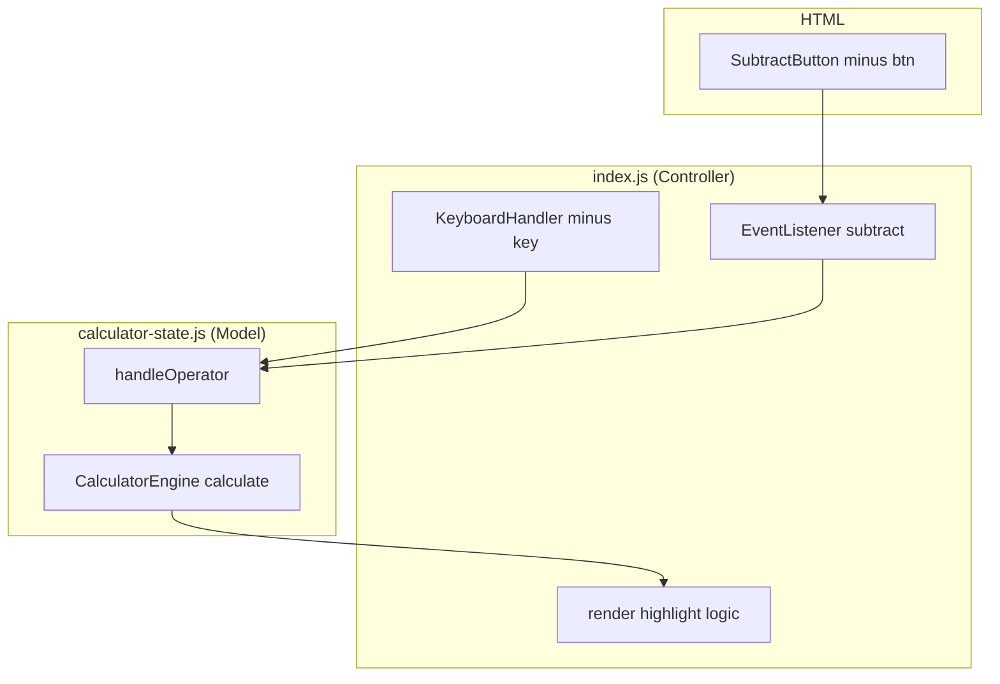
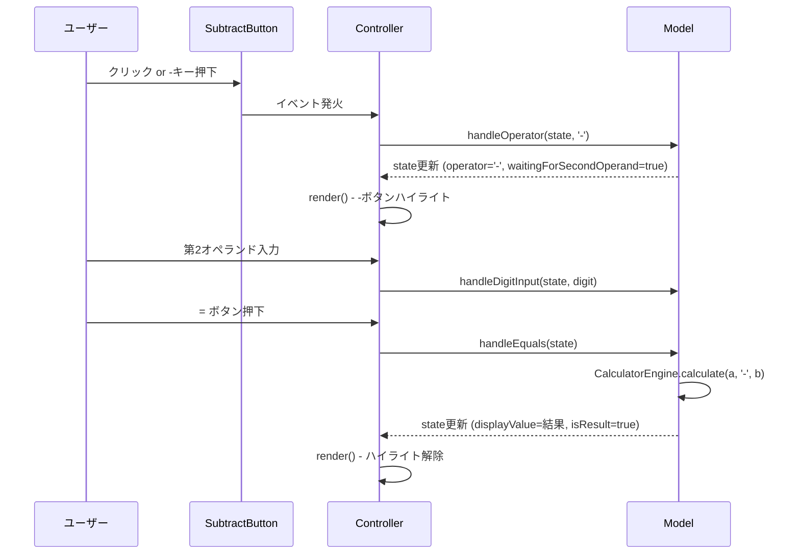

# 設計ドキュメント：subtraction（引き算機能）

---

## Overview

本フィーチャーは、既存のiPhoneスタイル電卓WebアプリへのSubtraction（引き算）機能を追加する。現状は加算（+）のみ実装されており、演算エンジン・UIボタン・イベントハンドリング・テストをそれぞれ最小限の変更で拡張する。

**Purpose**: 引き算ボタンの追加により、ユーザーが加算と同一の操作感で減算を行える。
**Users**: ブラウザ上で電卓を操作するエンドユーザー、および機能の回帰を防止する開発者。
**Impact**: 既存の `+` フローを変更せず、`-` 演算子に対応したブランチを各レイヤーに追加する。

### Goals

- iOS標準電卓の配置（行3第4列）に準拠した `−` ボタンをUIに追加する
- `CalculatorEngine.calculate()` が `'-'` 演算子で正確な減算結果（浮動小数点補正済み）を返す
- 既存の `+` フロー（連続計算・繰り返しイコール・演算子切り替え）と同一の動作を `−` でも実現する
- キーボード `-` キー対応を追加し、マウスレス操作を可能にする

### Non-Goals

- 乗算（×）・除算（÷）の実装（別フィーチャーとして扱う）
- `+/-`（符号反転）・`%`（パーセント）ボタンの有効化
- 演算子管理の汎用フレームワーク化（YAGNI — 今回スコープ外）

---

## Requirements Traceability

| 要件 | サマリー | コンポーネント | インターフェース | フロー |
|------|---------|--------------|----------------|-------|
| 1.1 | −ボタンUI（スタイル） | SubtractButton (HTML) | — | — |
| 1.2 | ホバーエフェクト | SubtractButton (HTML) | — | — |
| 1.3 | aria-label付与 | SubtractButton (HTML) | — | — |
| 2.1 | calculate('-')実装 | CalculatorEngine | `calculate(a, op, b)` | — |
| 2.2 | 浮動小数点補正 | CalculatorEngine | `calculate(a, op, b)` | — |
| 2.3 | 非有限数入力時NaN | CalculatorEngine | `calculate(a, op, b)` | — |
| 2.4 | 指数表記 | CalculatorEngine | `formatDisplay(v)` | — |
| 3.1〜3.5 | 操作フロー | CalculatorController (index.js) | `handleOperator(state, op)` | 計算フロー図 |
| 4.1〜4.3 | 演算子ハイライト | CalculatorController (index.js) | `render()` | — |
| 5.1〜5.2 | キーボード対応 | CalculatorController (index.js) | `keydown` ハンドラ | — |
| 6.1〜6.4 | テスト | TestSuite | Node.js test files | — |

---

## Architecture

### Existing Architecture Analysis

既存システムはフラット構成・MVC的責務分離を採用:

- **Model** (`calculator-state.js`): 演算エンジン（`CalculatorEngine`）＋純粋関数群（`handleXxx`）。DOM非依存。
- **View/Controller** (`index.js`): イベントリスナー登録・`render()` によるDOM更新。
- **View** (`calculator-view.js`): 現在空のプレースホルダー（変更なし）。
- **HTML** (`index.html`): ボタンレイアウト、Tailwind CDN。

`handleOperator(state, operator)` はすでに任意演算子文字列を受け付けるため、状態管理層の変更は `CalculatorEngine.calculate()` への1ブランチ追加のみで済む。

### Architecture Pattern & Boundary Map



**Architecture Integration**:
- 選択パターン: Option A（既存コンポーネントの拡張）— 新規ファイル不要、既存境界を維持
- 既存パターン維持: DOM非依存Model・`handleXxx` 純粋関数・CommonJS 条件分岐
- 新コンポーネント不要: 既存ファイルへの最小追加のみ
- Steering 準拠: `kebab-case` ファイル名・`camelCase` 関数・`PascalCase` 定数オブジェクト

### Technology Stack

| レイヤー | 選択 | フィーチャーでの役割 | 備考 |
|---------|------|-------------------|------|
| UI | HTML + Tailwind CSS (CDN) | −ボタンの配置・スタイリング | 既存 `+` ボタンのクラスを流用 |
| Controller | Vanilla JS (ES6+) | イベント登録・レンダリング・キー対応 | `index.js` へ追記 |
| Model | Vanilla JS (ES6+) | 減算ロジック・状態管理 | `calculator-state.js` へ追記 |
| Test | Node.js (CommonJS) | ユニットテスト実行 | `test-engine.js` / `test-state.js` へ追記 |

---

## System Flows

### 計算フロー（引き算操作）



---

## Components and Interfaces

### コンポーネントサマリー

| コンポーネント | レイヤー | Intent | 要件カバレッジ | 主要依存 | Contracts |
|-------------|---------|--------|-------------|---------|-----------|
| SubtractButton | HTML/UI | −ボタンのマークアップ | 1.1, 1.2, 1.3 | Tailwind CSS (P1) | — |
| CalculatorEngine (拡張) | Model | 減算ロジック追加 | 2.1, 2.2, 2.3, 2.4 | なし | State |
| CalculatorController (拡張) | Controller | イベント・レンダリング拡張 | 3.1〜3.5, 4.1〜4.3, 5.1〜5.2 | CalculatorEngine (P0) | State |
| TestSuite (拡張) | Test | 減算テストケース追加 | 6.1〜6.4 | CalculatorEngine, State (P0) | — |

---

### HTML / UI

#### SubtractButton

| フィールド | 詳細 |
|----------|------|
| Intent | iOS電卓準拠位置（行3第4列: 4,5,6の右）に−ボタンを配置 |
| Requirements | 1.1, 1.2, 1.3 |

**Responsibilities & Constraints**
- `id="btn-subtract"`, `data-action="subtract"` 属性を付与し、Controllerからの参照を一意にする
- Tailwind クラスは既存 `btn-add` と同一（`bg-[#FF9500] text-white`）を使用
- `aria-label="引く"` を付与

**契約: State [ ]**
HTMLマークアップのみ（ロジックなし）。Controller がこのIDを通じてイベントを購読する。

**Implementation Notes**
- 行3の `<div></div>` プレースホルダーを `<button id="btn-subtract" ...>` に置き換える
- `grid-cols-4` レイアウトへの影響なし（要素数変化なし）

---

### Model (`calculator-state.js`)

#### CalculatorEngine — calculate() 拡張

| フィールド | 詳細 |
|----------|------|
| Intent | `'-'` 演算子に対して浮動小数点補正済みの減算結果を返す |
| Requirements | 2.1, 2.2, 2.3, 2.4 |

**Responsibilities & Constraints**
- 既存の `'+'` ブランチに続けて `else if (operator === '-')` ブランチを追加
- `formatDisplay()` は変更不要（指数表記・エラー処理は既存実装で対応済み — 2.4）
- 引数の有限性チェック（`!isFinite(a) || !isFinite(b)` → `NaN`）は既存ガード節で対応済み — 2.3

**Contracts**: State [x]

##### State Management

```
// CalculatorEngine.calculate() の拡張後の契約
// 入力: a (number), operator ('+' | '-'), b (number)
// 出力: number (有限数) | NaN (無効入力 or 未対応演算子)
// 不変条件: isFinite(a) && isFinite(b) の場合のみ有効な数値を返す
// 浮動小数点補正: parseFloat(result.toPrecision(12)) を適用
```

**Implementation Notes**
- 統合: `handleOperator`・`handleEquals` は `CalculatorEngine.calculate()` を呼び出すだけ — 既存コード変更不要
- 検証: `toPrecision(12)` 適用により `0.3 - 0.1 === 0.2` が成立することをテストで確認（2.2）
- リスク: 既存 `+` テストへの影響なし（ブランチ追加のみ）

---

### Controller (`index.js`)

#### CalculatorController — 引き算対応拡張

| フィールド | 詳細 |
|----------|------|
| Intent | −ボタンのイベント登録・ハイライトレンダリング汎用化・キーボード対応 |
| Requirements | 3.1, 3.2, 3.3, 3.4, 3.5, 4.1, 4.2, 4.3, 5.1, 5.2 |

**Responsibilities & Constraints**
- `btn-subtract` に `click` イベントリスナーを追加し `handleOperator(state, '-')` を呼び出す（3.1〜3.5）
- `render()` のハイライトロジックをボタンIDと演算子記号のペアで評価するよう拡張する（4.1〜4.3）
- `keydown` ハンドラに `e.key === '-'` の分岐を追加する（5.1, 5.2）
- 既存の `handleOperator` 経由で連続計算・繰り返しイコールが自動的に機能する（3.3〜3.5 充足）

**Dependencies**
- Inbound: SubtractButton (HTML) — クリックイベント (P0)
- Outbound: `handleOperator(state, '-')` — 状態更新 (P0)
- Outbound: `CalculatorEngine.calculate()` — render()内での間接依存 (P0)

**Contracts**: State [x]

##### State Management

```
// render() ハイライトロジックの設計契約
// 入力: state.operator ('+' | '-' | null), state.waitingForSecondOperand (boolean)
// 評価: 各演算子ボタンについて (state.operator === op && state.waitingForSecondOperand) を独立評価
// 出力: 真 → 白背景/オレンジ文字、偽 → オレンジ背景/白文字
//
// keydown ハンドラ拡張契約
// e.key === '-' → e.preventDefault(); handleOperator(state, '-'); render();
```

**Implementation Notes**
- 統合: `btn-subtract` のリスナー追加は `btn-add` のリスナー直後に配置（コード局所性の維持）
- 検証: `+` ボタンのハイライトが `-` 選択時にデフォルト状態に戻ることをテストで確認（4.2）
- リスク: `render()` に条件分岐を2件追加するが、既存の `+` ロジックに変更なし

---

### Test (`test-engine.js`, `test-state.js`)

#### TestSuite — 減算テストケース追加

| フィールド | 詳細 |
|----------|------|
| Intent | 減算ロジック・操作フロー・繰り返しイコールのユニットテストを追加 |
| Requirements | 6.1, 6.2, 6.3, 6.4 |

**Responsibilities & Constraints**
- 既存の `assertEqual` / `assert` ヘルパーを流用（新規テストランナー不要）
- `test-engine.js`: `CalculatorEngine.calculate()` の減算テスト（整数・小数・負の結果）（6.1）
- `test-state.js`: 操作フローテスト（入力→-→入力→=）・繰り返しイコールテスト（6.2, 6.3）
- 既存の `+` テストに変更を加えない

**Implementation Notes**
- 統合: 各テストファイル末尾のサマリー出力前に追記
- リスク: 既存テストが全件通過する状態でのみマージする（6.4）

---

## Error Handling

### エラー戦略

減算機能は既存のエラーハンドリングパターンを継承する。

| エラーシナリオ | 条件 | レスポンス |
|-------------|------|-----------|
| 無効入力（NaN） | `calculate()` の引数が非有限数 | `NaN` 返却 → `formatDisplay` が `"エラー"` を表示 |
| 演算子未設定で `=` | `state.operator === null` | `handleEquals` が早期リターン（既存実装） |
| 9桁超過 | 入力中の数字が9桁に達した場合 | `handleDigitInput` がブロック（既存実装） |

追加のエラーパスは不要（既存ガード節で全カバー済み）。

---

## Testing Strategy

### Unit Tests — CalculatorEngine（`test-engine.js` への追記）

- `calculate(8, '-', 3)` → `5`（整数減算）
- `calculate(0.3, '-', 0.1)` → `0.2`（浮動小数点補正確認）
- `calculate(3, '-', 8)` → `-5`（負の結果）
- `calculate(Infinity, '-', 1)` → `NaN`（非有限数ガード）

### Unit Tests — State Flow（`test-state.js` への追記）

- `8 - 3 =` → `displayValue === '5'`（基本減算フロー）
- `8 - 3 = =` → `displayValue === '2'`（繰り返しイコール）
- `8 - 3 = = =` → `displayValue === '-1'`（繰り返しイコール連打）
- `+` 選択後に `-` 選択 → 演算子が `'-'` に切り替わること
- `-` 選択中に `AC` → 状態全リセット

### Regression

- 既存の `+` テストが全件 `passed` で通ることを確認してからマージする
